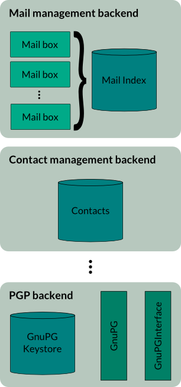
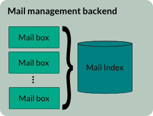
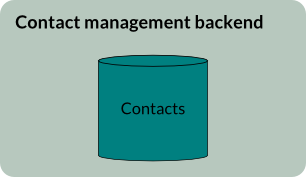
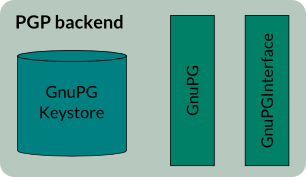
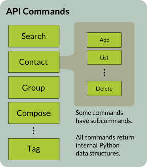
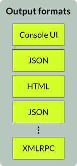
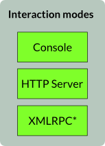

# Mailpile functionality layout

This guide is here to help you figure out how Mailpile is designed. It is not a 
user guide - it is a guide for new developers and others needing to understand 
the high level design of Mailpile. It is not a threat model or security brief. 
It is not a user experience design specification. It is not a vending machine. 
It will not absolve developers from having to read and understand the code.

## Backend data stores

Mailpile has a number of backend data stores for different types of data. Each 
backend exposes an internal interface. These can be seen as "Models".

Data stores do not currently have a standardized interface. No currently defined
data store uses and external database.

### Mail management backend

The mail management backend reads in e-mail from defined sources, including IMAP,
Mbox, Maildirs and Mac Mail.app directories, scans them and enters them into the
search engine index. This search engine component is one of the central components
of Mailpile. The search engine is mostly defined in `mailpile/search.py`, but
some importers are defined in `mailpile/mailboxes/`.

### Contact backend

Contacts are stored locally as VCards in the `vcards/` directory in the configuration
directory. The contacts backend transparently manages their creation, destruction,
etc. On runtime all the VCards are loaded into memory and interacted with there. This
speeds up access and allows for fast sorting, searching, etc.

### PGP backend

Mailpile will never access your PGP keystore directly. It will interact through 
a GnuPG interface with GnuPG as it is installed on the local computer, and will
therefore only have access to actions provided by the GnuPG binary.

Mailpile will not make any assumptions about the nature of your GnuPG keystore, 
but upon setup, if no keystore is found, it will generate a fresh 4096 bit 
RSA/RSA PGP key for you if GnuPG is available, assigned to the user defined 
identity. If GnuPG is not available, GnuPG will be disabled and the user will 
be presented with a grave warning.

### Other backends

There may be other backends for various purposes.

## Commands

There are in addition a number of API commands. Each command can have zero or 
more subcommands. These return internal Python data structures that are to be 
used in output. These can be seen as "Views".

Each command is internally subclassed from `Command` and returns a 
`CommandResult` typed object. Commands are defined in `commands.py`, and some 
of the core commands are defined there or in other parts of the system. Most 
commands are defined as plugins though, which is partially just a convenient 
segregation between backends and API, but partially a not particularly subtle 
way of suggesting that everything can in theory be overridden. Don't try that 
at home unless you really mean it.

## Output formatters

The output formatters each consume an internal data structure from a command, 
and based on the data and other context provided will format the output 
appropriately. In most cases the output format will consist exclusively of the 
data output from the command, but sometimes when the output format requires, it 
will bake in further data provided as extra context. Some will use some kind of 
template format to structure the data.

### JSON formatter

The JSON formatter will hand you back a JSON blob. The JHTML formatter will 
hand you back a formatted HTML partial wrapped in a JSON blob for easy 
consumption into JavaScript.

### HTML formatter

The HTML formatter will hand you back a fully kitted HTML UI containing a view 
of the data in question, with additional UI tidbits. This is not very clean or 
RESTful, but it does mean that the HTML output is fully usable by people who do 
not use JavaScript, and we get this almost for free without having to repeat 
ourselves (because DRY).

The HTML formetter gets information about which templates to use from the array 
`TEMPLATE_IDS` in the command class. If the command is subclassing another 
command and does not define its template, it will use the parent classes 
template. Subcommands use the template basename defined in `TEMPLATE_IDS` 
followed by an underscore and then the subcommand name. So the _add_ subcommand 
in the _contact_ command ("contact add") will use the template 
`contact_add.html`.

These templates exist in the `html/` directory of the current template. For the 
default template this is `static/default/html/` from the Mailpile base 
directory.

### XMLRPC

WRITE ME

## Interaction modes

All interaction with the system is done through an interaction mode, currently 
either a console or HTTP server. These consume commands and parameters and 
return output. Every interaction mode can return every output format, although 
some may be meaningless to the given mode.

### Command Line Interface (CLI)

WRITE ME

### HTTP Server

WRITE ME

### XMLRPC bindings

WRITE ME

### Pythonic interaction

WRITE ME

## API access and command structure

WRITE ME

